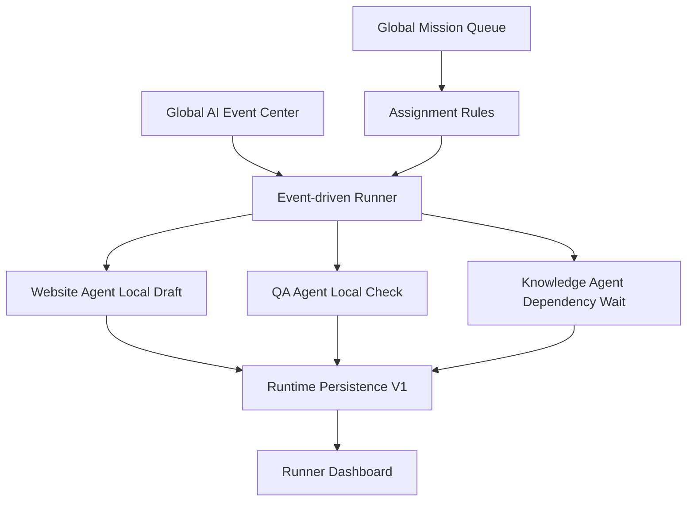

# M8A AI Employee Auto Runner V1 报告

日期：2026-07-09

## 结论

AI Employee Auto Runner V1 已建立。M8A 的 AI 员工已经从“有档案、有队列、有事件、有运行数据层”进入“可自动领取本地 A 类 Build 任务并产出本地结果”的阶段。

本 Sprint 属于 A 类 Build，不需要 CEO 外部授权。未调用 n8n、WordPress、Gmail、YouTube 或外部 API；未发布、未删除、未修改生产环境。

## Runner 架构

## Assignment Flow

Runner 按以下规则领取任务：

1. Priority：P0 > P1 > P2 > P3。
2. Dependency Status：Knowledge / QA / CEO 依赖未满足时等待。
3. Agent Capability：按员工能力匹配任务。
4. Mission Type：只领取 A 类 Build / local validation。
5. Safety Gate：B 类 External Action 不自动执行。

## Event-driven Flow

Runner 使用 Global AI Event Center V1 的 Event Schema。当前验证事件包括：

- Mission Started
- Draft Ready
- QA Started
- QA Passed

触发规则来自配置文件，不写死业务逻辑。

## Safety Gate

允许自动执行：

- A 类 Build
- 本地验证
- 本地草稿
- 本地 QA
- 本地报告

禁止自动执行：

- n8n
- WordPress
- publish
- delete
- update_published_post
- send_gmail
- upload_youtube
- external_api

## Website Agent 自动草稿验证

Website Agent 已从安全可领取 Mission 中生成本地标准 JSON Draft Output：

`apps/commander/ai_employee_runner_v1/outputs/website_agent_local_draft_output.v1.json`

结果：Draft First，不发布，不调用外部平台。

## QA Agent 自动检查验证

QA Agent 使用 QA V2 逻辑生成本地 QA 结果：

`apps/commander/ai_employee_runner_v1/outputs/qa_agent_auto_check_result.v1.json`

QA Score：92。低于 90 的规则已保留；即使通过，也不会进入发布，仍需 CEO 外部授权。

## Runtime Log 验证

Runner 已写入：

- 本地 runner runtime log
- Runtime Persistence V1 runtime_logs
- mission_events / event_history

文件：`apps/commander/ai_employee_runner_v1/logs/runner_runtime_log.v1.json`

## Dashboard 接入说明

总控台已加入 AI Employee Auto Runner V1 状态卡片。

Runner Dashboard 数据：

`apps/dashboard/ai_employee_runner_status.json`

显示：谁完成、谁等待依赖、今日完成、失败次数、平均耗时、QA 平均分、Blocked 数量。

## 风险与下一步建议

当前 Runner 是本地 Build Runner，适合安全验证。未来建议：

1. 增加真实 task lease / lock，避免多个 Runner 抢同一任务。
2. 将 Runner 执行状态完全转入 SQLite。
3. 建立 Local Worker Executor Adapter，只执行 A 类 Build。
4. B 类 External Action 继续要求 CEO 单独授权。
5. Publishing Agent 只在 QA + CEO + Safety Gate 全部通过后进入待执行状态，不能自动发布。

## 是否支持未来 20+ AI 员工自动上岗

结论：架构支持 20+ AI 员工的本地自动领取与执行；高并发时需要数据库锁、任务租约、幂等 key、事件去重和 Worker 心跳。

## 验证结果

- Runner 模块化文件已生成。
- Website Agent 本地 Draft 输出已生成。
- QA Agent 本地 QA 输出已生成。
- Runner Runtime Log 已生成。
- Runtime Persistence V1 已写入 Runner 日志和事件。
- 未调用任何外部平台。
