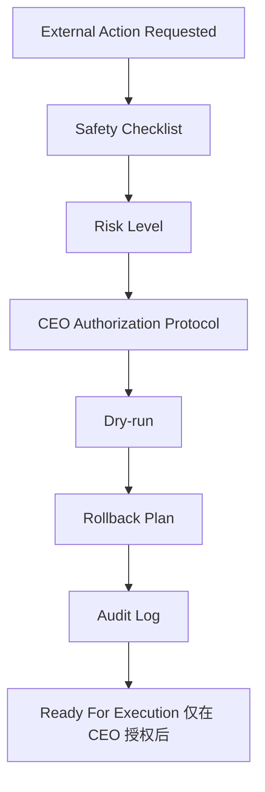

# M8A AI Employee Production Safety Gate V1 报告

日期：2026-07-09

## 结论

AI Employee Production Safety Gate V1 已建立。M8A 在本地 Auto Runner 之后，已经具备从 A 类 Build 进入 B 类 External Action 的统一安全闸门、审批协议、风险分级、Dry-run、Rollback 和 Audit Log。

本 Sprint 属于 A 类 Build，不需要 CEO 外部授权。未调用 n8n、WordPress、Gmail、YouTube、Google API 或任何外部 API；未发布、未删除、未修改生产环境。

## Safety Gate 架构

## B 类动作标准

B 类 External Action 包括：

- n8n
- WordPress
- Gmail
- YouTube
- Google API
- Publish
- Delete
- Update Published Content
- Send Email
- Upload Video

所有 B 类动作默认禁止自动执行。

## CEO 授权协议

每次外部动作必须包含：Mission ID、Action ID、Platform、Action Type、Risk Level、Payload Summary、Safety Checklist、Rollback Plan、Requested By、Approved By、Approval Time、Expiration、One-time Token、Idempotency Key。

Schema：`apps/commander/production_safety_gate_v1/schemas/ceo_external_action_authorization.schema.json`

## External Action Queue

状态：waiting_approval、approved、rejected、expired、ready_for_dry_run、dry_run_passed、ready_for_execution、executed、failed、archived。

当前只生成了 Dry-run passed 样例，没有进入真实执行。

## Risk Model

风险等级：

- low：低
- medium：中
- high：高
- prohibited：禁止

Dashboard 使用中文解释风险。

## Dry-run Flow

Dry-run 只生成 payload preview，不调用外部平台。已校验：payload 字段、目标平台、禁止动作、安全边界。

Dry-run 结果：`apps/commander/production_safety_gate_v1/dry_run/hk620_wp_draft_only.dry_run_result.v1.json`

## Rollback Strategy

默认回滚计划：撤销授权、标记失败、保留证据、人工检查草稿、禁止自动删除。

即使只是 Draft，也必须记录失败后处理方式。

## Audit Log

所有授权、拒绝、Dry-run、执行前检查、执行结果都必须写入 Runtime DB / 本地日志。

本次已写入本地 audit log，并同步到 Runtime Persistence V1 的 runtime_logs。

## Dashboard 接入说明

总控台已加入“生产安全闸门”状态卡片。

Dashboard 数据：`apps/dashboard/production_safety_gate_status.json`

显示：等待授权、已授权、已拒绝、已过期、Dry-run 通过、待执行、已执行、失败。

## 风险与下一步建议

当前只建立安全闸门和 Dry-run，不具备真实外部执行。下一步建议：

1. 建立 CEO Authorization UI。
2. 建立 one-time token / idempotency key 生成器。
3. 建立 External Executor Adapter，但默认关闭。
4. 所有真实执行都必须先通过 Dry-run + CEO 授权。
5. 执行后必须写入 Audit Log 和 Runtime DB。

## 是否已具备从本地 Build 安全进入真实外部执行的前置条件

结论：具备前置标准，但尚未授权真实执行。现在有 B 类动作标准、CEO 授权协议、External Action Queue、Safety Checklist、Risk Model、Dry-run、Rollback、Audit Log。真实执行仍需要 CEO 单独授权和执行器接入。

## 验证结果

- 所有新增 JSON 可解析。
- Dry-run payload preview 已生成。
- External Action Queue 已生成。
- Audit Log 已写入本地文件和 Runtime DB。
- 总控台状态卡片已接入。
- 未调用任何外部平台。
