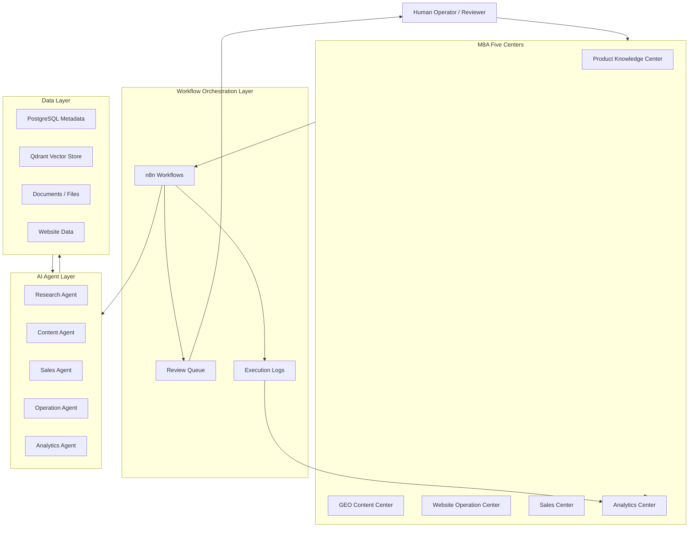
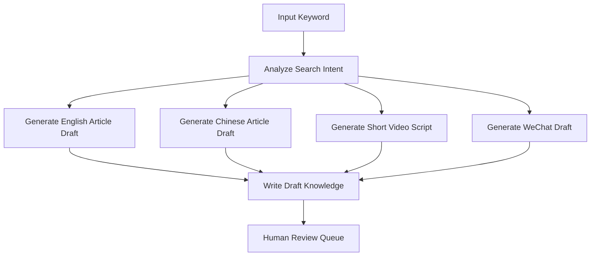
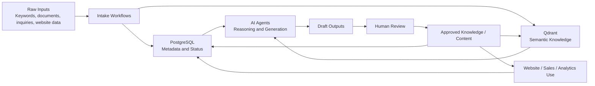
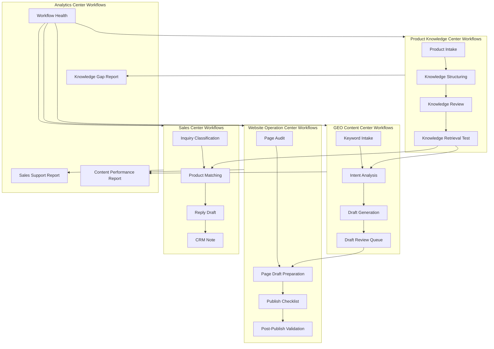
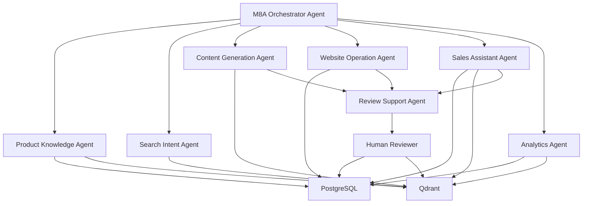

# M8A Enterprise Architecture V1

Version: V1  
Date: 2026-07-06  
Scope: enterprise AI operation architecture for the next 12 months

## 1. Architecture Positioning

M8A is an AI Operation Center for industrial marketing, product knowledge, website operations, sales enablement, and business analytics.

The core design principle is:

> Knowledge first, workflow second, agent third, publishing last.

M8A should not be treated as a single automation tool. It should be designed as an enterprise operating layer where product knowledge, content production, website operations, sales support, and analytics share the same data foundation.

## 2. Overall Architecture



## 3. Five Centers

### 3.1 Product Knowledge Center

Purpose: become the trusted source of product facts, technical details, use cases, comparisons, and internal product explanations.

| Area | Design |
|---|---|
| Input | Product model, product documents, factory notes, technical parameters, application cases, photos, videos, FAQs |
| Output | Structured product knowledge, product summaries, FAQ answers, sales talking points, content source material |
| Data Sources | Product manuals, website pages, internal documents, engineering notes, sales feedback, customer questions |
| Workflow | Product knowledge intake, product profile generation, knowledge review, knowledge update, retrieval validation |
| AI Agent | Product Knowledge Agent, Technical QA Agent, Product Comparison Agent |
| Database | PostgreSQL stores product metadata, category, model, language, status, source, owner, review status |
| Qdrant Usage | Store product knowledge chunks for semantic search, product comparison, RAG answers, and content grounding |

Recommended first domain:

```text
Knowledge Base
└── Products
    ├── HK620
    ├── HK680
    ├── HK568
    └── ...
```

Core records:

```text
product_model
category
technical_features
applications
target_customer
common_questions
source_document
language
status
reviewed_by
updated_at
```

### 3.2 GEO Content Center

Purpose: generate search-intent-aware, AI-search-ready, multilingual content drafts based on approved knowledge.

GEO means generative engine optimization: content designed for Google, AI search engines, ChatGPT-style answer engines, and buyer research journeys.

| Area | Design |
|---|---|
| Input | Keyword, search intent, target market, product model, approved product knowledge |
| Output | English article draft, Chinese article draft, short video script, WeChat article draft, FAQ blocks |
| Data Sources | Product Knowledge Center, approved FAQs, market keywords, competitor topics, search intent notes |
| Workflow | Keyword intake, intent analysis, outline generation, article drafting, multilingual adaptation, draft review, knowledge write-back |
| AI Agent | Search Intent Agent, English Content Agent, Chinese Content Agent, Video Script Agent, WeChat Draft Agent |
| Database | PostgreSQL stores content task, keyword, market, language, content type, draft status, reviewer, approval state |
| Qdrant Usage | Retrieve approved product knowledge and previous content; detect duplication; support semantic topic clustering |

Draft pipeline:



Content must remain draft until reviewed.

### 3.3 Website Operation Center

Purpose: manage website content operations, website health, product page updates, SEO/GEO improvements, and publishing readiness.

| Area | Design |
|---|---|
| Input | Approved content, product updates, page audit results, website status, publishing request |
| Output | Website update plan, page drafts, metadata drafts, internal publishing tasks, operation logs |
| Data Sources | Website pages, sitemap, CMS records, Product Knowledge Center, GEO Content Center, Analytics Center |
| Workflow | Website page audit, page draft preparation, metadata draft, publish checklist, post-publish validation |
| AI Agent | Website Audit Agent, Page Optimization Agent, Metadata Agent, Publishing QA Agent |
| Database | PostgreSQL stores page records, URL, page type, language, publish status, review status, last audit time |
| Qdrant Usage | Store page content vectors for similarity checks, content gap analysis, internal linking suggestions |

Important boundary:

Website Operation Center prepares and validates content. Publishing should remain approval-based until enterprise controls are mature.

### 3.4 Sales Center

Purpose: turn approved product and content knowledge into sales support assets, customer answers, quotation support, and lead-context summaries.

| Area | Design |
|---|---|
| Input | Customer question, product interest, region, inquiry text, sales notes, approved product knowledge |
| Output | Sales FAQ answer, customer reply draft, product recommendation, comparison note, lead summary |
| Data Sources | Product Knowledge Center, Sales FAQ, CRM records, customer service records, approved website content |
| Workflow | Inquiry classification, product match, FAQ retrieval, reply draft generation, sales handoff, CRM note creation |
| AI Agent | Sales Assistant Agent, Product Matching Agent, Customer Reply Agent, CRM Summary Agent |
| Database | PostgreSQL stores leads, inquiry category, customer profile, product interest, response status, follow-up status |
| Qdrant Usage | Retrieve similar customer questions, approved answers, product explanations, and previous sales cases |

Sales Center must use approved knowledge. It should not invent specifications, prices, delivery terms, or guarantees.

### 3.5 Analytics Center

Purpose: provide visibility into workflows, content output, knowledge coverage, website operations, and sales support performance.

| Area | Design |
|---|---|
| Input | Workflow execution logs, content status, knowledge status, website audit records, sales interaction records |
| Output | Dashboards, weekly reports, bottleneck reports, content coverage reports, operation health scores |
| Data Sources | n8n execution logs, PostgreSQL records, Qdrant collection stats, website data, CRM data |
| Workflow | Daily health summary, weekly content report, knowledge gap report, workflow failure analysis, sales support report |
| AI Agent | Analytics Agent, Workflow Monitor Agent, Knowledge Gap Agent, Performance Summary Agent |
| Database | PostgreSQL stores metrics, status snapshots, workflow results, review time, failure reason, task owner |
| Qdrant Usage | Analyze semantic coverage, cluster topics, detect repeated issues, find knowledge gaps |

Analytics Center is the feedback loop for the other four centers.

## 4. Enterprise Data Flow



Data rules:

1. Raw data must be labeled by source and status.
2. AI output must be stored as draft before review.
3. Approved knowledge becomes reusable enterprise memory.
4. Website publishing and customer-facing output require approval gates.
5. Analytics must read from workflow records, not from assumptions.

## 5. Workflow Call Relationship



Workflow principles:

1. Product Knowledge workflows feed all other centers.
2. GEO Content workflows generate drafts, not final publishing.
3. Website workflows consume approved content.
4. Sales workflows consume approved knowledge and approved FAQ.
5. Analytics workflows monitor all centers and identify gaps.

## 6. Agent Call Relationship



Agent governance:

1. Agents can draft, classify, retrieve, compare, and summarize.
2. Agents cannot publish, approve, quote binding prices, or change official product specifications.
3. Agents must cite source knowledge where possible.
4. Agents must write status and execution outcome to PostgreSQL.
5. Agents should use Qdrant for retrieval, not as the source of operational truth.

## 7. Data Model Direction

### 7.1 PostgreSQL Responsibilities

PostgreSQL is the system of record for structured business data:

```text
products
knowledge_items
content_tasks
content_assets
review_queue
website_pages
sales_inquiries
workflow_runs
agent_runs
analytics_snapshots
```

PostgreSQL stores:

```text
id
entity_type
center
status
source
owner
reviewer
created_at
updated_at
approved_at
workflow_id
agent_id
qdrant_collection
qdrant_point_id
```

### 7.2 Qdrant Responsibilities

Qdrant is the semantic memory layer:

```text
product_knowledge_vectors
content_vectors
sales_faq_vectors
website_page_vectors
company_document_vectors
sop_vectors
```

Qdrant stores embeddings and payload references, not final approval truth.

Recommended payload fields:

```text
entity_id
entity_type
center
category
product_model
language
status
source
version
created_at
updated_at
```

## 8. Review And Approval Model

M8A should use a staged approval model:

```text
draft
review_pending
revision_required
approved
published
archived
```

Rules:

1. AI-generated content starts as `draft`.
2. Human review moves draft to `approved`.
3. Website or customer-facing use requires `approved`.
4. Published content should be traceable back to source knowledge.
5. Archived knowledge should not be used for new generation unless explicitly requested.

## 9. Future Extension Plan

### Phase 1: Foundation

Goal: stable internal AI operation base.

Deliverables:

```text
Product Knowledge Center MVP
Knowledge metadata schema
Qdrant collection strategy
Manual review queue
Workflow execution logging
Basic analytics dashboard
```

### Phase 2: Content Production

Goal: repeatable draft generation from approved knowledge.

Deliverables:

```text
Keyword to draft pipeline
English article draft
Chinese article draft
Short video script draft
WeChat draft
Duplicate detection
Human approval workflow
```

### Phase 3: Website Operations

Goal: controlled website operation support.

Deliverables:

```text
Website page inventory
Page audit workflow
Metadata draft generation
Internal linking suggestions
Publish checklist
Post-publish validation
```

### Phase 4: Sales Enablement

Goal: approved knowledge supports sales and customer response.

Deliverables:

```text
Sales FAQ retrieval
Inquiry classification
Product matching
Customer reply draft
CRM note generation
Sales knowledge gap report
```

### Phase 5: Enterprise Operation Intelligence

Goal: M8A becomes the AI operating layer across departments.

Deliverables:

```text
Cross-center analytics
Workflow SLA monitoring
Agent performance review
Knowledge freshness scoring
Content ROI reporting
Sales support effectiveness
Role-based access model
Audit trail
```

## 10. One-Year Architecture Roadmap

| Quarter | Focus | Target Outcome |
|---|---|---|
| Q1 | Knowledge foundation | Product Knowledge Center and Qdrant RAG become reliable |
| Q2 | Content draft production | GEO Content Center generates reviewed multilingual drafts |
| Q3 | Website and sales operations | Website Operation Center and Sales Center consume approved knowledge |
| Q4 | Enterprise analytics | Analytics Center measures output, quality, gaps, and business value |

## 11. Architecture Boundaries

M8A V1 should avoid these risks:

1. Auto-publishing before review is mature.
2. Using AI output as approved product truth.
3. Mixing draft content with approved knowledge.
4. Letting Qdrant replace PostgreSQL as the source of record.
5. Building many workflows before status, logging, and review are stable.
6. Connecting external channels before internal governance is ready.
7. Creating agents without clear permissions and failure handling.

## 12. V1 Success Criteria

M8A Enterprise Architecture V1 is successful when:

1. Product knowledge can be created, reviewed, approved, searched, and reused.
2. GEO content can be generated as drafts from approved knowledge.
3. Website operation tasks can be prepared from approved content.
4. Sales responses can retrieve approved knowledge and create draft answers.
5. Analytics can show workflow status, content status, knowledge gaps, and operational bottlenecks.
6. Every AI output has source, status, owner, and review trail.

## 13. Recommended Next Step

The next implementation phase should be:

```text
P4-A: Product Knowledge Center MVP
```

Scope:

1. Define Product Knowledge metadata.
2. Create first real product knowledge item: HK620.
3. Store metadata in PostgreSQL.
4. Store semantic chunks in Qdrant.
5. Retrieve HK620 knowledge through a controlled internal test.

This keeps M8A aligned with the enterprise architecture while avoiding premature business automation.
