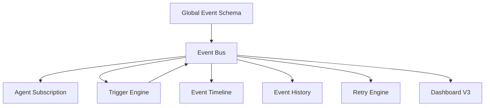
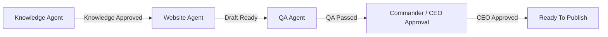

# M8A Global AI Event Center V1 Report

日期：2026-07-09

## 状态报告

上一轮总经理线程显示 interrupted / systemError。经本地检查：Global Employee Mission Center V1 已完成；Global AI Event Center V1 此前尚未生成文件。本次已在本线程补完 Global AI Event Center V1。

本 Sprint 属于 A 类 Build，本地建设任务，不需要 CEO 审批。未调用 n8n，未调用 WordPress，未调用 Gmail、YouTube 或任何外部 API，未发布、未删除、未修改生产环境。

## 总体架构

## Event Flow

## Event Bus

Event Bus 已模块化：

- Schema：`apps/commander/event_center_v1/schemas/global_event.schema.json`
- Event Types：`apps/commander/event_center_v1/rules/event_types.rules.json`
- Bus：`apps/commander/event_center_v1/bus/event_bus.v1.json`
- Subscriptions：`apps/commander/event_center_v1/subscriptions/agent_subscriptions.v1.json`
- Trigger Engine：`apps/commander/event_center_v1/triggers/trigger_engine.v1.json`
- Timeline：`apps/commander/event_center_v1/runtime/event_timeline.v1.json`
- History：`apps/commander/event_center_v1/history/event_history.v1.json`
- Retry：`apps/commander/event_center_v1/retry/event_retry_engine.v1.json`

## Trigger Engine

Trigger 全部配置化，不写死：

- Knowledge Approved → Website Agent Mission Started
- QA Passed → CEO Approval Requested
- CEO Approved → Ready To Publish
- QA Failed → Mission Failed

## Subscription Model

每个 Agent 通过 subscription 记录声明：

- Subscribe
- Unsubscribe
- Listening Events
- Supported Events

未来新增 AI 员工只需要新增 subscription，不需要改 Event Center 核心。

## Timeline

Event Timeline 支持：

- Created
- Received
- Started
- Finished
- Failed
- Blocked
- Retry

## History

Event History 永久保存本地 JSON，并提供查询索引：

- 按 Mission 查询
- 按 Agent 查询
- 按日期查询

## Retry Strategy

Retry Engine 支持：

- Timeout
- Missing Dependency
- Validation Failed
- Internal Error
- Network Reserved

Network Reserved 仅预留，不连接外部网络。

## Dashboard V3

Dashboard：`apps/dashboard/global_event_center.html`

显示：

- Today Events
- Running Events
- Failed Events
- Blocked Events
- Waiting Events
- Top Active Agent
- Average Processing Time
- Event Timeline

## Event Simulation 验证

已用本地模拟事件验证完整链路：

Knowledge Agent → Website Agent → QA Agent → CEO Approval

结果：simulation_passed_local_only。

注意：Ready To Publish 只是本地事件状态，未触发发布。

## 风险分析

- 当前为本地 JSON Event Bus，适合 Build 阶段和轻并发。
- 20+ 员工同时写入时，需要数据库或 append-only event store。
- Trigger Engine 当前只生成本地事件，未接入真实 Worker。
- Published 事件仅预留，不能被当前系统执行。

## 未来扩展建议

1. 将 Event History 迁移到 SQLite / PostgreSQL / event store。
2. 增加事件锁、幂等 key、去重策略。
3. 给每个 Agent 增加 heartbeat 和 listener 状态。
4. 将 Mission Center 与 Event Center 建立双向索引。
5. 下一阶段可做 Local Event Worker Adapter V1，仅执行 A 类 Build。

## 是否支持未来 20+ AI 员工协同

结论：支持 20+ AI 员工的事件模型、订阅模型、Dashboard 展示和本地模拟协同；如果 20+ 员工同时写入事件，需要升级为数据库 / event-store。

## 验证结果

- 所有新增 JSON 可解析。
- 全局 Event Schema 字段完整。
- Dashboard V3 页面脚本语法通过。
- 模拟事件链完整通过。

## CEO 授权

本 Sprint 不需要 CEO 授权。任何 n8n、WordPress、Gmail、YouTube、外部 API、发布、删除、生产环境修改，仍必须 CEO 单独授权。
