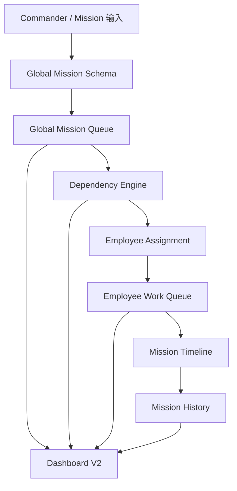
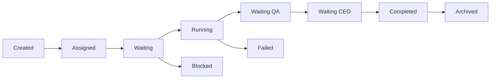
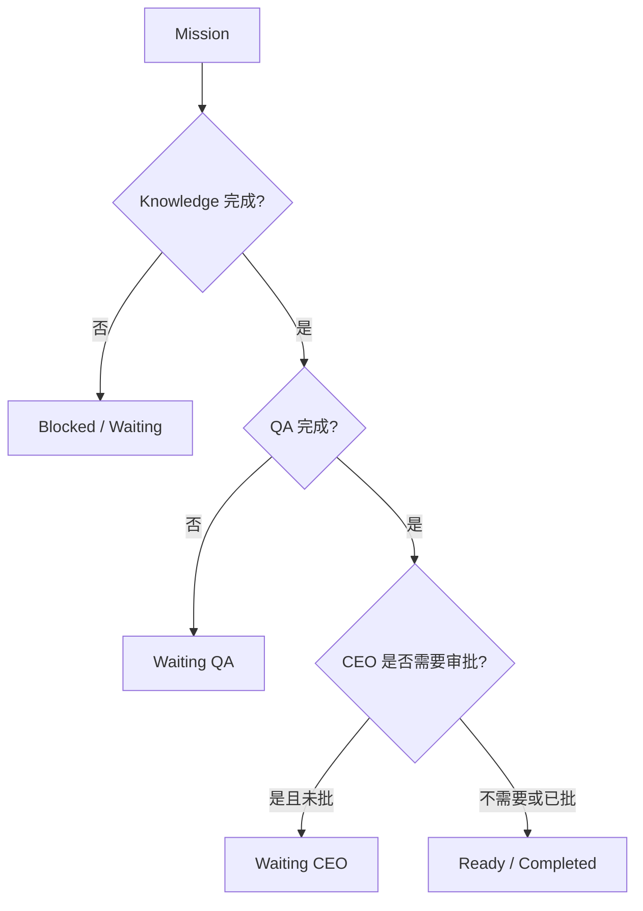
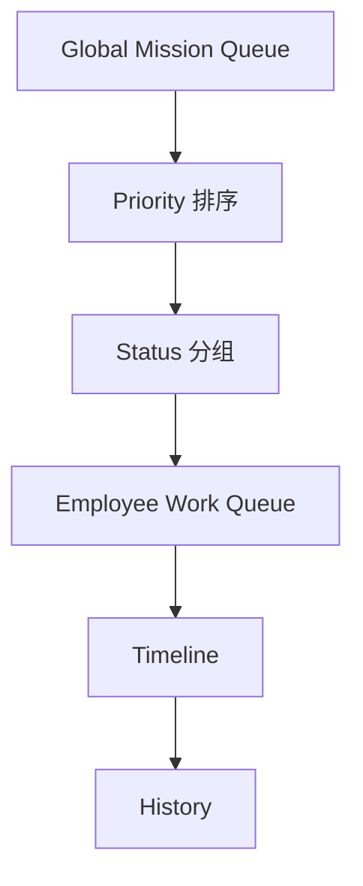
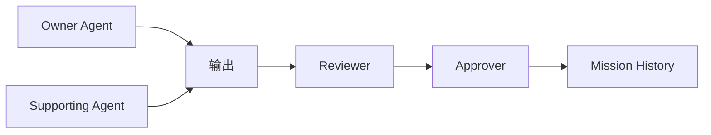

# M8A Global Employee Mission Center V1 Sprint Review

日期：2026-07-09

## 结论

Global Employee Mission Center V1 已建立。Mission Queue 已从 Website Agent / HK620 局部队列提升为 M8A 全局统一任务中枢。未来所有 AI 员工共用同一套 Mission System。

本 Sprint 属于 A 类 Build，本地建设任务，不需要 CEO 审批。未调用 n8n，未调用 WordPress，未连接外部 API，未发布、未删除、未修改生产环境。

## 已确认不重复开发

以下能力已存在，本次只接入全局中枢，不重复开发：

- Commander V1
- Website Agent V1
- Website Agent Execution Chain V1
- Website Agent State Machine V1
- Website Agent Knowledge Binding V1
- Product Knowledge Gap Task Center V1
- Employee Workbench V1

## 总体架构图

## Mission Flow

## Dependency Flow

## Queue Flow

## Employee Flow

## 已完成模块

1. Global Mission Queue：统一 Waiting、Running、Blocked、Waiting QA、Waiting CEO、Completed、Failed、Archived。
2. Mission Priority：P0 Critical、P1 High、P2 Normal、P3 Low。
3. Mission Dependency Engine：自动识别 Knowledge 未完成、QA 未完成、CEO 未批准、公开发布阻断、外部动作未授权。
4. Global Employee Assignment：Owner Agent、Supporting Agent、Reviewer、Approver。
5. Employee Work Queue：当前任务、待办数量、今日完成、平均耗时、失败次数、QA 平均分、Blocked 数量。
6. Mission Timeline：Created、Assigned、Running、Blocked、QA、CEO Review、Completed。
7. Mission History：永久本地 JSON 保存 Mission、负责人、耗时、结果、错误、QA、审批。
8. Dashboard V2：Mission Queue、Mission Priority、Mission Timeline、Employee Queue、Blocked Mission、Knowledge Gap、Ready To Publish、CEO Waiting Approval。
9. 统一 Mission Schema：禁止不同 Agent 自定义核心字段。

## Dashboard 截图说明

本地页面：`apps/dashboard/global_mission_center.html`

打开后第一屏显示：

- 总 Mission 数
- Blocked 数
- Waiting CEO 数
- Knowledge Gap 数
- Ready To Publish 数
- 是否支持 20 名 AI 员工

页面下方显示：

- Mission Queue
- Mission Priority
- Employee Queue
- Blocked Mission
- Knowledge Gap
- Ready To Publish
- CEO Waiting Approval
- Mission Timeline

## 风险

- 当前是本地 JSON 文件中枢，适合 Build 阶段和轻并发；多进程同时写入时需要数据库或事件日志。
- QA 平均分目前来自结构字段，后续需要接入真实 QA 评分记录。
- 依赖识别已规则化，但还没有实时执行器。
- Mission History 当前是 JSON 永久记录，未来需要可查询索引。

## 是否支持未来至少 20 名 AI 员工同时工作

结论：当前结构支持 20 名 AI 员工的任务展示、分配、状态汇总和历史记录；如果 20 名员工同时写入任务状态，需要升级为 SQLite / PostgreSQL / event store。

改进方案：

1. 将 `global_mission_queue.v1.json` 迁移到数据库表。
2. 将 Mission Timeline 改为 append-only event log。
3. 增加 Mission lock / owner lease，避免多个员工同时改同一任务。
4. 增加 Dashboard 缓存层，只读聚合数据。
5. 增加每个 Agent 的执行心跳和失败重试记录。

## 未来扩展建议

- 接入所有 Agent 的标准 Profile 和 Queue。
- 建立 Mission 查询页，按产品、Agent、状态、优先级过滤。
- 把 QA Score、审批结果、发布状态纳入可搜索历史。
- 将 Build 类和外部平台类 Mission 分开授权。
- 下一阶段再考虑真实执行器接入，但仍需 CEO 单独授权。

## 下一阶段建议

下一阶段建议做：Global Mission Center → Local Worker Executor Adapter V1。

目标不是调用外部平台，而是让本地 Build 类任务能被统一 Worker 接收、执行、回写状态和 Timeline。

## 验证方式

1. 打开 `apps/dashboard/global_mission_center.html`。
2. 确认能看到 Mission Queue、Mission Priority、Employee Queue、Blocked Mission、Knowledge Gap、Ready To Publish、CEO Waiting Approval、Mission Timeline。
3. 检查 `apps/commander/mission_center_v1/runtime/global_mission_queue.v1.json`。
4. 检查 `apps/commander/mission_center_v1/schemas/global_mission.schema.json`。
5. 确认所有 JSON 可解析。

## CEO 授权

本 Sprint 不需要 CEO 授权。

未来任何 n8n、WordPress、外部 API、发布、删除、生产环境修改，仍必须 CEO 单独授权。
