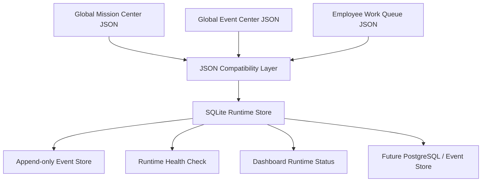

# M8A Local Event Store & Runtime Persistence V1 报告

日期：2026-07-09

## 结论

已建立 M8A 本地长期运行数据层 V1。Mission Center 与 Event Center 现在具备从 JSON 过渡到可靠本地持久化的路径。

本 Sprint 属于 A 类 Build，不需要 CEO 外部授权。未调用 n8n、WordPress、Gmail、YouTube 或任何外部 API；未发布、未删除、未修改生产环境。

## 架构图

## 数据表设计

SQLite V1 包含：

- missions
- mission_events
- event_history
- employee_queues
- employee_status
- mission_timeline
- approvals
- qa_results
- runtime_logs
- retry_records

Schema 文件：`apps/commander/runtime_persistence_v1/schemas/sqlite_runtime_schema.v1.sql`

## JSON 兼容策略

现有 JSON 不废弃，继续作为配置与 Dashboard 输入：

- Global Mission Center JSON 继续可读。
- Global AI Event Center JSON 继续可读。
- Employee Work Queue JSON 继续可读。
- Dashboard 不被破坏。
- SQLite 先作为 runtime store 和迁移兼容层。

## Migration Plan

1. 从 `global_mission_queue.v1.json` 导入 missions / mission_timeline。
2. 从 `event_history.v1.json` 导入 mission_events / event_history。
3. 从 `employee_work_queue.v1.json` 导入 employee_status / employee_queues。
4. schemas / rules / subscriptions / triggers 保留为配置。
5. runtime 数据逐步迁入 SQLite。
6. 未来高并发升级 PostgreSQL / append-only event store。

## Append-only Event Store

所有事件先 append，不直接覆盖。修正事件时追加 correction event，不修改原事件。

支持查询：

- mission_id
- agent_id
- event_type
- date

支持审计：event_hash、timestamp、payload_json。

## Dashboard 接入说明

总控台已加入“本地运行数据层”状态卡片。

本地状态数据：`apps/dashboard/runtime_persistence_status.json`

显示：

- 存储模式
- Mission 数
- Event 数
- 最近事件
- 健康状态
- 迁移状态

## Simulation Verification

已把 Knowledge Agent → Website Agent → QA Agent → CEO Approval 的模拟事件链写入 SQLite runtime store，并验证查询：

- 按 mission_id 查询
- 按 agent 查询
- 按 event_type 查询
- 按 date 查询

验证结果：passed_local_runtime_store_only。

## 风险与下一步建议

当前 SQLite 方案适合本地长期运行和轻并发。未来 20+ AI 员工同时写入时，建议：

1. 改为 append-only event log。
2. 增加写入锁和幂等 key。
3. 使用 PostgreSQL 或专用 event store。
4. Dashboard 读取只读聚合视图。
5. Worker 写入统一通过 Runtime Persistence API。

## 是否支持未来 20+ AI 员工协同

结论：当前设计支持 20+ AI 员工的本地状态持久化、事件审计和 Dashboard 展示；如果 20+ 员工同时高频写入，需要升级 PostgreSQL / event-store。

## 验证结果

- SQLite 数据库已创建。
- 必需表结构完整。
- 事件写入检查通过。
- 模拟链路记录检查通过。
- JSON 兼容层已建立。
- 总控台状态卡片已接入。
