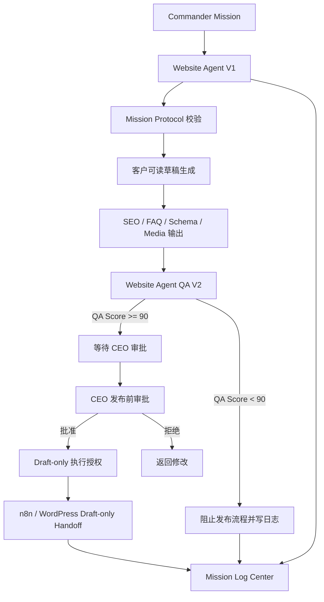

# M8A Sprint：Website Agent V1 Completion Report

日期：2026-07-09
范围：AI Employee Center V1 / Website Agent V1 标准员工架构

## 一、先确认已完成能力

本 Sprint 开始前先审计现有项目与报告，结论如下。以下能力已存在或已被报告验证，本次不重复开发。

| 能力 | 验证结果 | 证据 |
|---|---|---|
| Commander Mission 输入入口 | 已完成 | `apps/dashboard/index.html` 已有 Mission 标准输入窗口与本地 Mission 队列 |
| CEO Approval 审批链路 | 已完成 | 总控台本地审批、发布前审批、n8n 单独授权状态链已存在 |
| Website Agent Draft Generation | 已完成 | `docs/M8A_WEBSITE_AGENT_FIRST_CONTENT_PIPELINE_ARTICLE_DRAFT_V1.md` 与总控台本地草稿链路 |
| QA Checklist | 已完成 V1，本 Sprint 升级为 V2 标准 | `docs/M8A_WEBSITE_AGENT_FIRST_CONTENT_PIPELINE_QA_REPORT_V1.md` |
| n8n Webhook | 已完成 | Production endpoint 已登记：`/webhook/m8a-hk620-draft-only` |
| Commander → n8n 调用 | 已完成 | `docs/M8A_20260709_收工报告.md` 记录 execution #32 |
| WordPress Draft 创建 | 已完成 | `docs/M8A_20260709_收工报告.md` 与 `M8A_WEBSITE_AGENT_FIRST_CONTENT_PIPELINE_RESULT_V1.json` |
| HK620 Draft 测试 | 已完成 | WordPress Draft：`HK620 Draft Test from M8A`，状态 Draft 未发布 |
| Workflow 正式命名 | 需人工确认 | 当前要求保留为待 CEO 在 n8n 外部确认，不由页面静默修改 |
| Mission Log 与长期记录 | 已完成本地记录，本 Sprint 标准化 schema | `localStorage: m8a_acceptance_20260709` 与 `mission_log.schema.json` |

结论：上述已验证链路不重复开发。本 Sprint 只补 Website Agent V1 的长期员工标准。

## 二、Sprint 目标

建立 M8A 第一位真正可长期工作的 AI 员工：Website Agent V1。

本次不是写一篇文章，不是 Demo，而是把 Website Agent 定义为可接 Mission、可输出结构化结果、可 QA、可记录日志、可重试、可扩展到其他产品的标准员工。

## 三、本次新增文件

```text
apps/commander/employees/website_agent_v1/
  README.md
  architecture/WEBSITE_AGENT_V1_ARCHITECTURE.md
  schemas/mission_protocol.schema.json
  schemas/standard_output.schema.json
  prompts/prompt_system.templates.json
  qa/website_agent_qa_v2.checklist.json
  logs/mission_log.schema.json
  retry/retry_engine.design.json
  dashboard/website_agent_dashboard.schema.json
  templates/website_agent_product_template.json

docs/M8A_WEBSITE_AGENT_V1_COMPLETION_REPORT.md
```

## 四、架构图



## 五、核心设计说明

### 1. Website Agent V1 标准目录

已新增独立目录，包含 Architecture、Lifecycle、Input、Output、错误处理、日志规范。

### 2. 统一 Mission Protocol

已定义 `mission_protocol.schema.json`，包含：Mission ID、Priority、Product、Language、Target Market、Target Platform、Expected Output、QA Status、Approval Status、Publish Status、Retry Count、Mission Log。

### 3. 统一 Prompt System

已定义模板：System Prompt、Developer Prompt、Mission Prompt、Output Format、Error Prompt、Retry Prompt。

### 4. Website Agent QA V2

已定义 QA 项：Title、Meta Description、Slug、H1、Heading Structure、Internal Links、External Links、Image Alt、FAQ、Schema、CTA、Grammar、Length、Brand Consistency。

规则：QA Score 低于 90 禁止进入发布流程。

### 5. 标准 JSON Output

已定义 Mission、Content、SEO、Media、Schema、FAQ、Publish Info、QA Result。

### 6. Mission Log Center

已定义开始时间、结束时间、执行 Agent、耗时、Token、状态、错误、最终结果、Mission History。

### 7. Retry Engine

已定义 Webhook 失败、WordPress 失败、Timeout、Validation Error、Network Error。所有失败必须写日志。

### 8. Dashboard 数据结构

已定义 Running Missions、Completed、Failed、Waiting Approval、Average Runtime、QA Score、Draft Count。

### 9. Website Agent Template

已定义可复用产品模板。未来 HK690、HK680、六面钻、CNC、Factory Solution、Blog、Knowledge 只替换产品资料，不重做流程。

## 六、剩余风险

1. Workflow 正式命名仍需 CEO 在 n8n 外部确认。
2. 重复 WordPress 测试草稿清理仍需 CEO 在 WordPress 外部确认。
3. Website Agent V1 当前是标准架构与数据契约，还未接入真实模型执行器。
4. QA Score 当前为规则标准，后续需要接入实际评分实现。
5. Mission Log Center 当前是 schema，后续需要接入统一运行时写入。

## 七、Technical Debt

1. 老的 Website Agent Handbook V1 与新 Website Agent V1 标准包需要后续合并索引。
2. 总控台 localStorage 任务状态需要迁移到长期数据库或 Commander Runtime。
3. n8n workflow bindings 中旧 workflow 风险标记需要继续保留。
4. Dashboard 指标 schema 已有，实际指标聚合器后续单独实现。

## 八、复用率评估

- Mission Protocol 复用率：90%
- Prompt System 复用率：85%
- QA V2 复用率：80%
- Standard Output 复用率：90%
- Retry Engine 复用率：75%
- Dashboard Schema 复用率：80%
- Product Template 复用率：90%

综合复用率：84%。

## 九、完成度评分

Website Agent V1 标准员工架构完成度：92 / 100。

扣分项：

- 真实模型执行器未接入。
- Mission Log Center 尚未接入持久化运行时。
- QA V2 尚未接入真实评分器。

## 十、下一 Sprint 建议

下一 Sprint 建议：Website Agent V1 Runtime Adapter。

目标：把本次 schema、prompt、QA、log、retry 标准接入一个本地可运行的 Website Agent 执行器，但仍保持安全门，不自动发布，不绕过 CEO 审批。

## 十一、安全确认

本 Sprint 没有调用 n8n，没有调用 WordPress，没有发布内容，没有删除外部内容，没有修改已发布文章。
